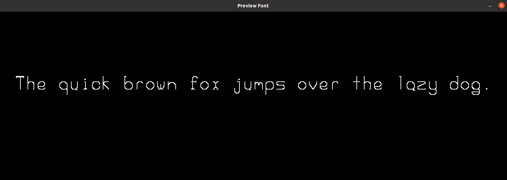

# Fonts

A collection of bitmap ASCII fonts (2 so far) and a very simple font previewer.

The previewer uses `OpenGL 3.3`, `GLEW`, `SDL2`, and `SDL_Image`. The Makefile is tested on Ubuntu 20.04.

For some integer N, each font file should be a (128N)x(2N) pixel PNG. Each character will be (Nx2N), and the pixel offset for a given character is its ASCII code \* N. For example, a 1024x16 pixel image will have 8x16 bitmaps for each character.

## Install:

`git clone https://github.com/lorentzj/fonts`

`cd fonts`

`make`

`./viewfont fonts/2.png "The quick brown fox jumps over the lazy dog."`

