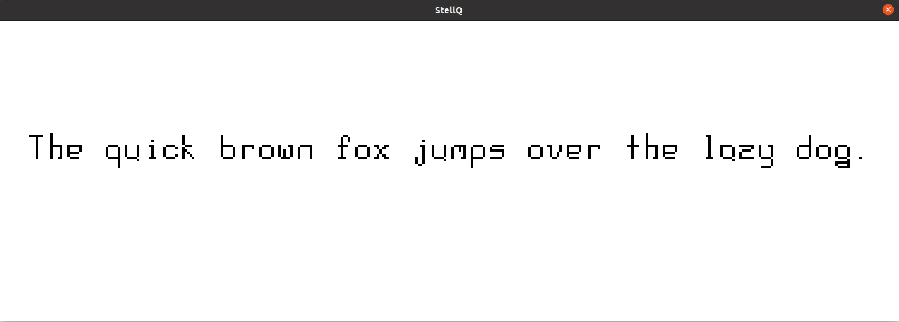

# StellQ

A collection of bitmap ASCII fonts (1 so far) and a very simple font previewer.

The previewer uses `OpenGL 3.3`, `GLEW`, `SDL2`, and `SDL_Image`. The Makefile is tested on Ubuntu 20.04.

Each font file is a 1024x16 pixel PNG, and each character is 8x16px, so the pixel offset for a given character is its ASCII code * 8.

## Install:

`git clone https://github.com/lorentzj/stellq`

`cd stellq`

`make`

`bin/stellq fonts/1.png "The quick brown fox jumps over the lazy dog."`

